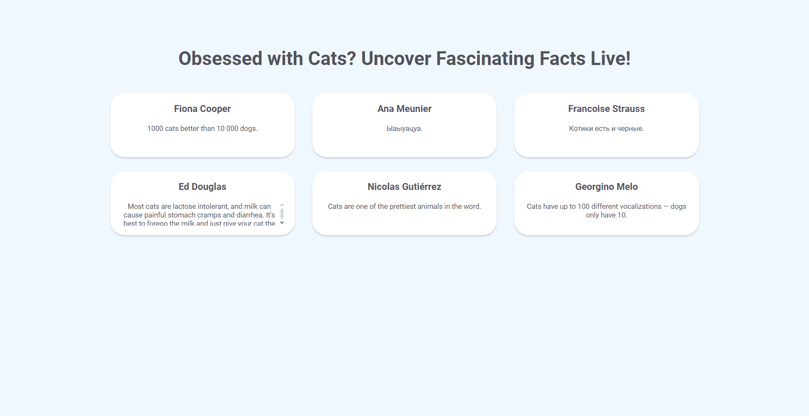

# Hitachi Energy Recruitment Task
## Description
This project is a Cat Facts WebApp designed to showcase both front-end and back-end development skills.
The application fetches random cat facts from public APIs and presents them in a responsive web interface.
The back-end service retrieves cat facts and associates them with random users, providing a seamless experience through server-sent events.

## Video
*This [Video](https://www.youtube.com/watch?v=sGy54tnophs) demonstrates the entire Cat Facts WebApp in action!*

## Screenshot
*This is how the application looks.*

 

## How to run
First, ensure that you have **Java 17** and **npm** installed.

Next open a Bash terminal and navigate to the project folder.

### For Windows Users:
Run the following command:
```bash
./start_app.sh
```
I have prepared a script that automatically starts the entire application!

### For Other Operating Systems:
Navigate to the server folder:
```bash
cd server
```

Run the following command to start the back-end:
```bash
./mvnw spring-boot:run
```
Then, navigate to the client folder:
```bash
cd ../client
```
Run the front-end with:
```bash
npm run dev
```
Finally, open your browser on the appropriate port to access the application.
